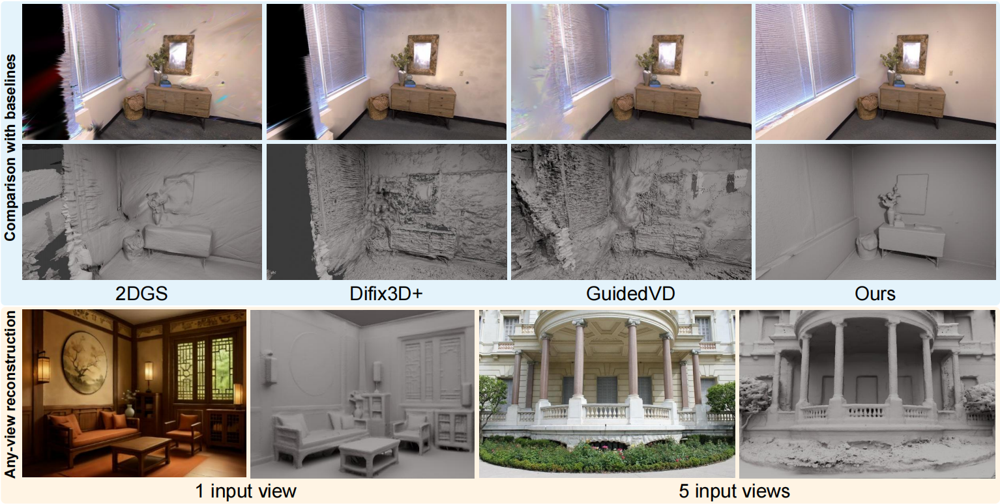

<h2 align="center" style="font-size:24px;">
  <b>G4Splat: Geometry-Guided Gaussian Splatting with Generative Prior</b>
  <br>

  <b><i>arXiv 2025 </i></b>
</h2>

<p align="center">
    <a href="https://dali-jack.github.io/Junfeng-Ni/">Junfeng Ni </a><sup>1,2,*</sup>,
    <a href="https://yixchen.github.io/">Yixin Chen </a><sup>2,✉</sup>,
    <a href="https://github.com/isxiaohe/">Zhifei Yang </a><sup>3</sup>,
    <a href="https://yuliu-ly.github.io/">Yu Liu </a><sup>1,2</sup>,
    <a href="https://jason-aplp.github.io/Ruijie-Lu/">Ruijie Lu </a><sup>3</sup>,
    <a href="https://zhusongchun.net/">Song-Chun Zhu </a><sup>1,2,3</sup>,
    <a href="https://siyuanhuang.com/">Siyuan Huang </a><sup>2,✉</sup>
    <br>
    <sup>*</sup> Work done as an intern at BIGAI &nbsp
    <sup>✉</sup> Corresponding author &nbsp
    <sup>1</sup>Tsinghua University 
    <br>
    <sup>2</sup>State Key Laboratory of General Artificial Intelligence, BIGAI &nbsp
    <sup>3</sup>Peking University
</p>

<p align="center">
    <a href='https://arxiv.org/abs/2510.12099'>
      
    </a>
    <a href='https://dali-jack.github.io/g4splat-web'>
      
    </a>
</p>

<p align="center">
    
</p>

<b>G4Splat</b> integrates <b>accurate geometry guidance with generative prior</b> to enhance 3D scene reconstruction, substantially improving both geometric fidelity and appearance quality in observed and unobserved regions.


## 1. Installation


### 1.1. Install dependencies

Please follow the instructions below to install the dependencies:

```shell
git clone https://github.com/DaLi-Jack/G4Splat.git --recursive

# Create and activate conda environment
conda create --name g4splat -y python=3.9
conda activate g4splat

# Install system dependencies via conda (required for compilation)
conda install cmake gmp cgal -c conda-forge

# Install PyTorch with CUDA support (adjust CUDA version as needed)
pip install torch==2.0.1 torchvision==0.15.2 torchaudio==2.0.2 --index-url https://download.pytorch.org/whl/cu118
pip install -r requirements.txt

pip install 'git+https://github.com/facebookresearch/pytorch3d.git@stable'
pip install 'git+https://github.com/facebookresearch/segment-anything.git'
# Detectron2 (used only for visualization)
pip install 'git+https://github.com/facebookresearch/detectron2.git'
```

Then, install the 2D Gaussian splatting and adaptive tetrahedralization dependencies:

```shell
cd 2d-gaussian-splatting/submodules/diff-surfel-rasterization
pip install -e .
cd ../simple-knn
pip install -e .
cd ../tetra-triangulation
cmake .
# you can specify your own cuda path
export CPATH=/usr/local/cuda-11.8/targets/x86_64-linux/include:$CPATH
export LD_LIBRARY_PATH=/usr/local/cuda-11.8/targets/x86_64-linux/lib:$LD_LIBRARY_PATH
export PATH=/usr/local/cuda-11.8/bin:$PATH
make 
pip install -e .
cd ../../../
```

Finally, install the MASt3R-SfM dependencies:

```shell
cd mast3r/asmk/cython
cythonize *.pyx
cd ..
pip install .
cd ../dust3r/croco/models/curope/
python setup.py build_ext --inplace
cd ../../../../../
```


### 1.2. Download pretrained models

First, download the pretrained checkpoint for DepthAnythingV2. Several encoder sizes are available; We recommend using the `large` encoder:

```shell
mkdir -p ./Depth-Anything-V2/checkpoints/
wget https://huggingface.co/depth-anything/Depth-Anything-V2-Large/resolve/main/depth_anything_v2_vitl.pth -P ./Depth-Anything-V2/checkpoints/
```

Then, download the MASt3R-SfM checkpoint:

```shell
mkdir -p ./mast3r/checkpoints/
wget https://download.europe.naverlabs.com/ComputerVision/MASt3R/MASt3R_ViTLarge_BaseDecoder_512_catmlpdpt_metric.pth -P ./mast3r/checkpoints/
```

Then, download the MASt3R-SfM retrieval checkpoint:

```shell
wget https://download.europe.naverlabs.com/ComputerVision/MASt3R/MASt3R_ViTLarge_BaseDecoder_512_catmlpdpt_metric_retrieval_trainingfree.pth -P ./mast3r/checkpoints/
wget https://download.europe.naverlabs.com/ComputerVision/MASt3R/MASt3R_ViTLarge_BaseDecoder_512_catmlpdpt_metric_retrieval_codebook.pkl -P ./mast3r/checkpoints/
```

Then, download the SAM checkpoint:
```shell
wget https://dl.fbaipublicfiles.com/segment_anything/sam_vit_h_4b8939.pth -P ./checkpoint/segment-anything/
```

Finally, download the See3D checkpoint:
```shell
# Download the See3D checkpoint from HuggingFace first, then move it to the desired path
mv YOUR_LOCAL_PATH/MVD_weights ./checkpoint/MVD_weights
```


## 2.data
Please download the preprocessed [data](https://huggingface.co/datasets/JunfengNi/G4Splat) from HuggingFace and unzip in the `data` folder. The resulting folder structure should be:
```bash
└── G4Splat
  └── data
    ├── replica
        ├── scan ...
    ├── scannetpp
        ├── scan ...
    ├── deepblending
        ├── scan ...
    ├── denseview
        ├── scan1
```


## 3.Training and Evaluation
The evaluation code is integrated into `train.py`, so evaluation will run automatically after training.
```bash
# Tested on A100 80GB GPU. You can add "--use_downsample_gaussians" to run on a 3090 24GB GPU.
python train.py -s data/DATASET_NAME/SCAN_ID -o output/DATASET_NAME/SCAN_ID --sfm_config posed --use_view_config --config_view_num 5 --select_inpaint_num 10  --tetra_downsample_ratio 0.25
```
**Note:** The reproduced results may vary due to the randomness inherent in the generative model (See3D), especially in unstructured regions such as ceilings. You may get worse or even better results than those reported in the paper. If the results are worse, simply rerunning the code should produce improved outcomes.

We also provide command for dense-view reconstruction:
```bash
# Tested on 3090 24GB GPU.
python train.py -s data/denseview/scan1 -o output/denseview/scan1 --sfm_config posed --use_view_config --config_view_num 20 --use_downsample_gaussians --tetra_downsample_ratio 0.25 --use_dense_view
```


## Acknowledgements
Some codes are borrowed from [MAtCha](https://github.com/Anttwo/MAtCha), [NeuralPlane](https://github.com/3dv-casia/NeuralPlane), [See3D](https://github.com/baaivision/See3D), [MASt3R-SfM](https://github.com/naver/mast3r), [DepthAnythingV2](https://github.com/DepthAnything/Depth-Anything-V2), [2DGS](https://github.com/hbb1/2d-gaussian-splatting) and [GOF](https://github.com/autonomousvision/gaussian-opacity-fields). We thank all the authors for their great work. 


## Citation

```bibtex
@article{ni2025g4splat,
    title={G4Splat: Geometry-Guided Gaussian Splatting with Generative Prior},
    author={Ni, Junfeng and Chen, Yixin and Yang, Zhifei and Liu, Yu and Lu, Ruijie and Zhu, Song-Chun and Huang, Siyuan},
    journal={arXiv preprint arXiv:2510.12099},
    year={2025}
}
```


