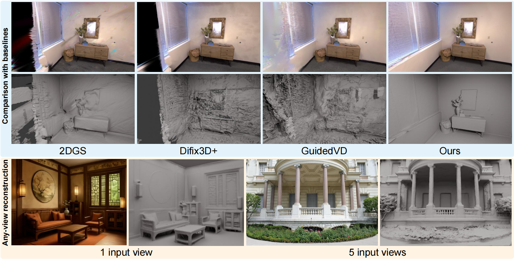

<h2 align="center" style="font-size:24px;">
  <b>G4Splat: Geometry-Guided Gaussian Splatting with Generative Prior</b>
  <br>

  <b><i>arXiv 2025 </i></b>
</h2>

<p align="center">
    <a href="https://dali-jack.github.io/Junfeng-Ni/">Junfeng Ni </a><sup>1,2,*</sup>,
    <a href="https://yixchen.github.io/">Yixin Chen </a><sup>2,✉</sup>,
    <a href="https://github.com/isxiaohe/">Zhifei Yang </a><sup>3</sup>,
    <a href="https://yuliu-ly.github.io/">Yu Liu </a><sup>1,2</sup>,
    <a href="https://jason-aplp.github.io/Ruijie-Lu/">Ruijie Lu </a><sup>3</sup>,
    <a href="https://zhusongchun.net/">Song-Chun Zhu </a><sup>1,2,3</sup>,
    <a href="https://siyuanhuang.com/">Siyuan Huang </a><sup>2,✉</sup>
    <br>
    <sup>*</sup> Work done as an intern at BIGAI &nbsp
    <sup>✉</sup> Corresponding author &nbsp
    <sup>1</sup>Tsinghua University 
    <br>
    <sup>2</sup>State Key Laboratory of General Artificial Intelligence, BIGAI &nbsp
    <sup>3</sup>Peking University
</p>

<p align="center">
    <a href='https://arxiv.org/abs/2510.12099'>
      
    </a>
    <a href='https://dali-jack.github.io/g4splat-web'>
      
    </a>
</p>

<p align="center">
    
</p>

<b>G4Splat</b> integrates <b>accurate geometry guidance with generative prior</b> to enhance 3D scene reconstruction, substantially improving both geometric fidelity and appearance quality in observed and unobserved regions.

We are currently organizing the code and expect to release it publicly within two weeks. Stay tuned!

## Citation

```bibtex
@article{ni2025g4splat,
    title={G4Splat: Geometry-Guided Gaussian Splatting with Generative Prior},
    author={Ni, Junfeng and Chen, Yixin and Yang, Zhifei and Liu, Yu and Lu, Ruijie and Zhu, Song-Chun and Huang, Siyuan},
    journal={arXiv preprint arXiv:2510.12099},
    year={2025}
}
```

